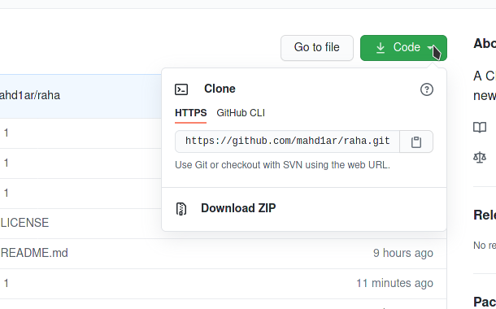
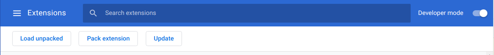

# raha
A Chrome extension to replace with a new tab

## how to install this locally

### download project into your computer

if you are using the git version control system, run the command below:

`git clone --depth 0 git@github.com:mahd1ar/raha.git`

or you can just click on the green button above and click download.

 download project on your computer and unzip it
open google chrome.

### open Chrome extensions tab
click on the menu on the top right of your Chrome window, click setting to open up the settings panel, and then click "Extensions" button

### Load into Extensions (manually!)
first, toggle "Developer mode" and then click "Load unpacked" and select the folder

and you are good to go