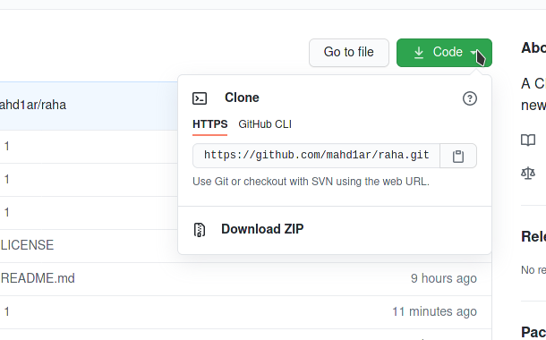
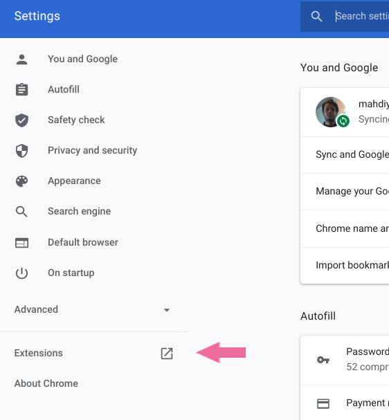
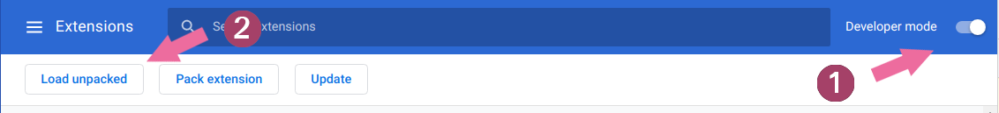

# Raha
A Chrome extension to replace with a new tab

## how to install this locally

### download project into your computer

if you are using the git version control system, run the command below:

`git clone --depth 0 git@github.com:mahd1ar/raha.git`

or you can just click on the green button above and click download.

 download the project on your computer and unzip it
open google chrome.

### open Chrome extensions tab
click on the menu from the top on the right side of your Chrome window, click setting to open up the settings panel, and then click "Extensions" button

### Load Extension (manually!)
first, toggle "Developer mode" and then click "Load unpacked" and select the project folder

and you are good to go

## credit:

Tanks to Brad Travercy and his awesome project that inspired me to do this

https://codepen.io/bradtraversy/pen/eYdMqvx
